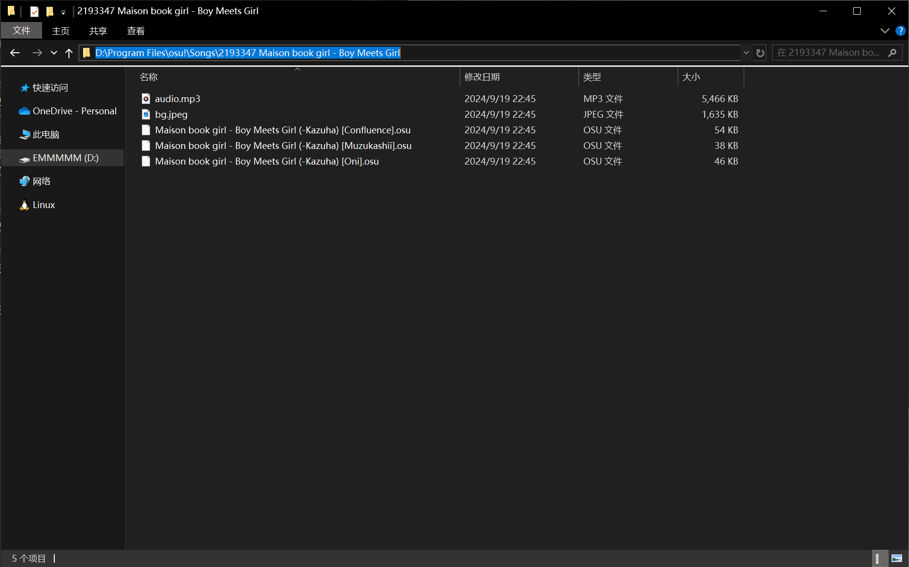
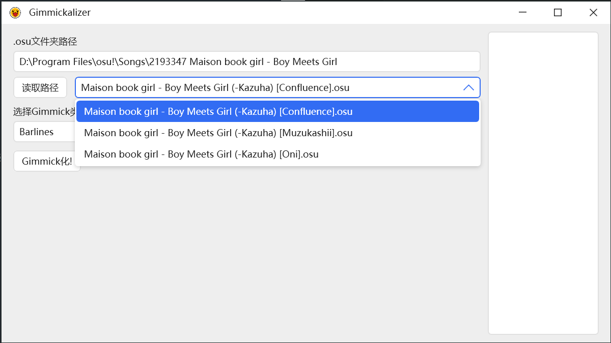
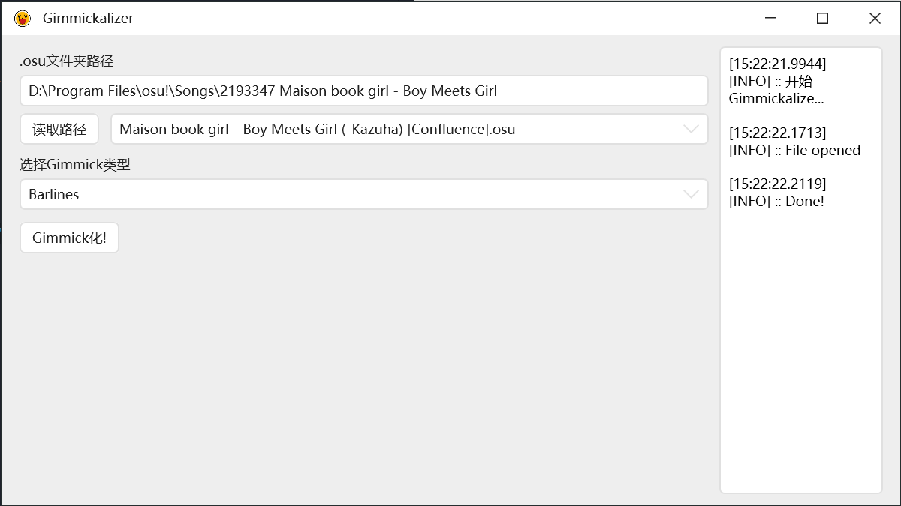
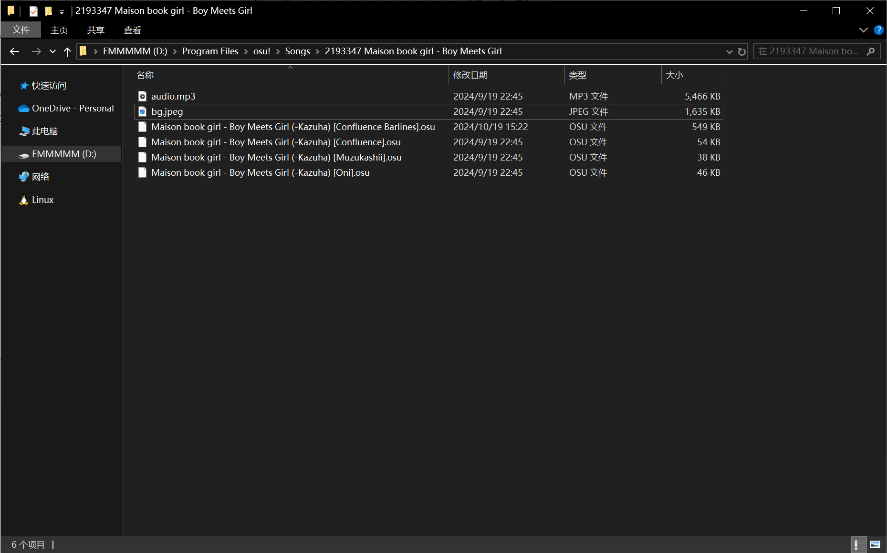

# Gimmickalizer

## 这是什么?
总所不那么周知, osu!taiko中有一类铺面叫Gimmick铺面. 由于Gimmick图练习成本较高, 且优质的Gimmick图对于一般玩家而言较难获取, 为了更为廉价地练习Gimmick图, 可以将普通的铺面转换为Gimmick图. 这个小程序可以较为轻松地帮助你做到这些.

## 如何使用?
本程序依赖`.NET 8.0`, 因此请在运行本程序前确保电脑上已安装相关依赖
你可以在终端中输入`dotnet --list-runtimes`查看已安装的运行时

如果未安装相关依赖, 可以在终端中输入`winget install Microsoft.DotNet.SDK.8`来进行安装
也可自行百度其他方法来安装依赖

双击`Gimmickalizer.exe`打开应用程序后将出现如下界面

左侧为程序交互界面, 右侧为日志输出界面

在".osu文件夹路径"处输入你想要Gimmick化的铺面文件夹路径
你可以在"文件资源管理器"中直接复制文件夹路径, 如下图所示

留意当前文件夹中的文件列表

点击"读取路径"后在下拉菜单中将出现可选择的难度

然后在在"选择Gimmick类型"的下拉菜单中选择类型, 最后点击"Gimmick化"按钮, 若右侧日志输出界面如下图所示, 则Gimmick化成功!

文件夹中已创建新的`.osu`文件

你可以开始在游戏里"愉快地"玩耍Gimmick图了!

## Features
- 全图转换为小节线的表现形式(细小节线为"咚", 粗小节线为"咔")

- 全图转换为黄饼的表现形式(小黄饼为"咚", 大黄饼为为"咔")

## 未来也许会支持的功能
- 限定Gimmick化的Timing区间以提高自由度
- 支持更多的Gimmick类型;
- 自动检查更新

## Credits
本程序编写的理论依据来源于[osu太鼓 梗譜論文](https://docs.google.com/document/u/0/d/163uEiV79liP13rzMbn7xGdAdZBoDYocCo1ldkNSQP8M/mobilebasic)